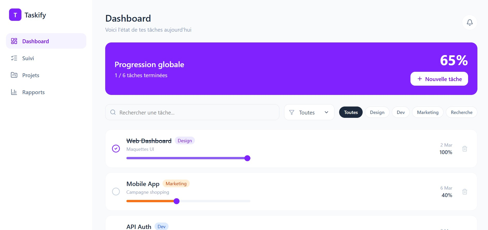

# Taskify Dashboard

A modern and responsive task management dashboard built with React and Vite.

## Live Demo

> Add your Netlify or Vercel link here after deployment.

## Preview



## Features

- Task creation
- Task completion tracking
- Task filtering
- Responsive design
- Modern dashboard UI

## Tech Stack

- React
- Vite
- JavaScript
- CSS

## Getting Started

Clone the repository:

```bash
git clone https://github.com/wissemHANACHI/taskify-dashboard.git
```

Install dependencies:

```bash
npm install
```

Run locally:

```bash
npm run dev
```

Build for production:

```bash
npm run build
```